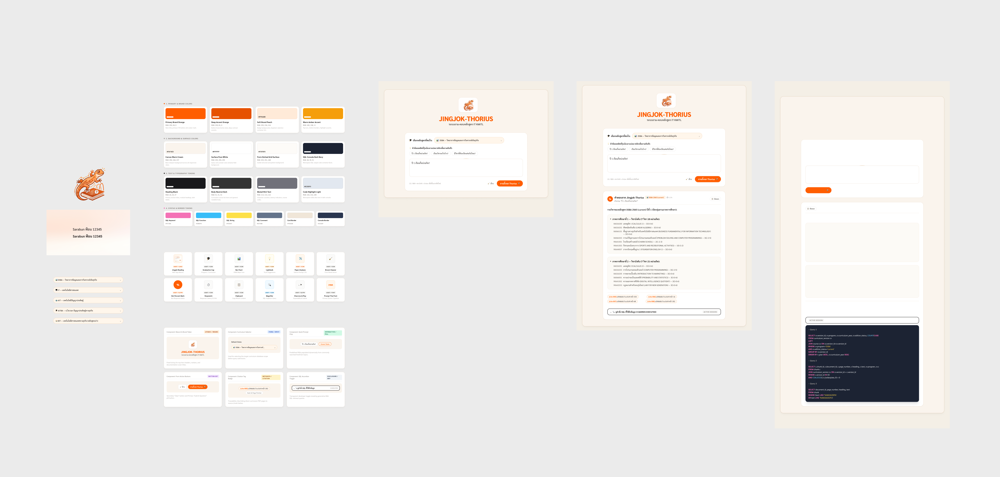

# 🦎 Jingjok-Thorius (น้องจิ้งจก-ทองหล่อ)
> **ระบบ AI อัจฉริยะสำหรับถาม-ตอบหลักสูตร คณะเทคโนโลยีสารสนเทศ สจล. (IT KMITL Curriculum QA & Document Intelligence)**

---

## 📋 สารบัญ (Table of Contents)
1. [ภาพรวมโครงการ (Overview)](#-ภาพรวมโครงการ-overview)
2. [ส่วนที่ 1: การออกแบบ Wireframe (Lab Part 1)](#-ส่วนที่-1-การออกแบบ-wireframe-lab-part-1)
3. [ส่วนที่ 2: ข้อกำหนด API Contract (Lab Part 2)](#-ส่วนที่-2-ข้อกำหนด-api-contract-lab-part-2)
4. [ส่วนที่ 3: การเชื่อมต่อ Web UI และ 4 สถานะ (Lab Part 3)](#-ส่วนที่-3-การเชื่อมต่อ-web-ui-และ-4-สถานะ-lab-part-3)
5. [ส่วนที่ 4: การติดตั้งและเริ่มต้นใช้งาน (Installation & Setup)](#-ส่วนที่-4-การติดตั้งและเริ่มต้นใช้งาน-installation--setup)
6. [ส่วนที่ 5: สรุปรายการไฟล์ส่งมอบ (Deliverables Checklist)](#-ส่วนที่-5-สรุปรายการไฟล์ส่งมอบ-deliverables-checklist)
7. [ส่วนที่ 6: สถาปัตยกรรมระบบ (Architecture)](#-ส่วนที่-6-สถาปัตยกรรมระบบ-architecture)
8. [ส่วนที่ 7: รายงานผลการประเมินและการทดสอบระบบ (Benchmark Evaluation)](#-ส่วนที่-7-รายงานผลการประเมินและการทดสอบระบบ-benchmark-evaluation)

---

## 🌟 ภาพรวมโครงการ (Overview)

**Jingjok-Thorius** เป็นระบบค้นหาและตอบคำถามเกี่ยวกับหลักสูตรการศึกษาของคณะเทคโนโลยีสารสนเทศ สถาบันเทคโนโลยีพระจอมเกล้าเจ้าคุณทหารลาดกระบัง (KMITL) จากเอกสารหลักสูตร มคอ.2 จำนวน 14 ฉบับ โดยมีจุดเด่นสำคัญ:
- **Provenance-First (อ้างอิงแหล่งที่มา 100%):** ทุกคำตอบจะระบุเอกสารต้นทาง เลขหน้า และพิกัด Bounding Box
- **Curriculum-Aware:** รองรับการจำแนกหลักสูตรทั้ง 5 สาขาอย่างถูกต้อง (IT, DSBA, AIT, BIT, AITBA)
- **High Transparency:** แสดงคำสั่ง SQL ที่ใช้ดึงข้อมูลจากฐานข้อมูลจริง เพื่อความโปร่งใสและตรวจสอบย้อนกลับได้
- **Modern Responsive Web UI:** หน้าเว็บแบบ Single Page Application (SPA) ธีมสีประจำสถาบัน KMITL (ส้มแสด `#FF6600`)

---

## 🎨 ส่วนที่ 1: การออกแบบ Wireframe (Lab Part 1)

ภาพ Wireframe ฉบับสมบูรณ์ถูกจัดทำบน Figma และบันทึกไว้ที่ไดเรกทอรี [`wireframe/wireframe-jingjok.png`](wireframe/wireframe-jingjok.png)



### 1.1 หน้าจอในระบบ (Available Screens & Views)
1. **หน้าจอค้นหาและถามคำตอบหลัก (Main Q&A Dashboard):**
   - ส่วนหัวแบรนด์เนมและมาสคอตน้องทองหล่อ
   - Dropdown สำหรับเลือกหลักสูตรที่ต้องการถาม
   - ปุ่มชิปคำถามยอดฮิต (Quick Prompt Chips) สำหรับกดถามได้ทันที
   - กล่องกรอกคำถาม Textarea พร้อมตัวนับอักขระ (0 / 800)
   - แผงแสดงผลคำตอบ พร้อมการเรนเดอร์ Markdown, ป้ายเวอร์ชัน และตัวจับเวลา Latency
   - แถบป้ายอ้างอิง (Citation Badges)
   - แผงพับดูคำสั่ง SQL (SQL Query Inspector)
2. **หน้าต่างป็อปอัปดูเอกสารต้นทาง (Document Page Viewer Modal):**
   - แสดงขึ้นมาเมื่อผู้ใช้คลิกที่ป้าย Citation ใด ๆ
   - แสดงชื่อเอกสาร มคอ.2, หัวข้อ, เลขหน้า, ข้อความเนื้อหาดิบ และ Canvas แสดงตำแหน่ง Bounding Box
3. **สถานะแสดงข้อผิดพลาด (Error Alert Banner):**
   - แสดงแถบเตือนสีแดง/ส้มเมื่อไม่ได้เลือกหลักสูตร หรือระบบขัดข้อง

### 1.2 สิทธิ์และการมองเห็นของผู้ใช้งานแต่ละกลุ่ม (Who Sees What)

| กลุ่มผู้ใช้งาน (User Persona) | วัตถุประสงค์ในการใช้งาน | หน้าจอและส่วนประกอบที่เข้าถึงได้ |
| :--- | :--- | :--- |
| **นักศึกษา / ผู้สนใจทั่วไป<br>(Students & General Users)** | ค้นหาข้อมูลรายวิชา, เช็คจำนวนหน่วยกิตปี 1, ตรวจสอบวิชาบังคับก่อน (Prerequisite) | • หน้าจอหลักสำหรับถามคำถาม<br>• ปุ่มคำถามด่วน (Quick Chips)<br>• อ่านคำตอบที่จัดรูปแบบสวยงาม<br>• คลิกดูป้าย Citation เพื่อเปิดดูหน้าเอกสารต้นทางยืนยันความถูกต้อง |
| **อาจารย์ / กรรมการหลักสูตร<br>(Faculty & Curriculum Committees)** | ตรวจสอบความถูกต้องของแผนการเรียนและการจัดหมวดหมู่วิชาในแต่ละเล่มหลักสูตร | • ทุกฟังก์ชันของนักศึกษา<br>• สามารถสลับดูข้อมูลเปรียบเทียบทั้ง 5 สาขาวิชา (IT, DSBA, AIT, BIT, AITBA)<br>• ตรวจสอบเลขหน้าและเนื้อหาที่แท้จริงจากเล่ม มคอ.2 ผ่าน Modal เอกสาร |
| **นักพัฒนา / ผู้ประเมินระบบ<br>(Developers & Evaluators)** | ตรวจสอบประสิทธิภาพ ความเร็ว และความแม่นยำในการดึงข้อมูลของระบบ RAG | • ดูตัวชี้วัดความเร็ว Latency (เช่น `⚡ 0.28s`)<br>• เปิดแผง Accordion ตรวจสอบคำสั่ง SQL จริง (`sql_query`)<br>• ดูจำนวน claim units ที่ผ่านการตรวจสอบความถูกต้อง |

### 1.3 Design Tokens & Typography
- **Primary Color:** สีส้มแสด KMITL (`#FF6600`, `#E65100`, `#C43D00`)
- **Background Color:** สีครีมสบายตา (`#FAF7F2`) และการ์ดสีขาวสะอาด (`#FFFFFF`)
- **Console Dark:** สีน้ำเงินเข้ม Slate (`#1E293B`) สำหรับกล่องโค้ด SQL
- **Font:** `Sarabun` (ฟอนต์มาตรฐานภาษาไทย มีหัว อ่านง่าย) ผสาน `Inter` (ภาษาอังกฤษและตัวเลข)

---

## 📡 ส่วนที่ 2: ข้อกำหนด API Contract (Lab Part 2)

ระบบให้บริการ REST API ทำงานที่ Base URL: `http://127.0.0.1:8000`

### 2.1 สรุป Endpoints ทั้งหมด

| Method | Endpoint Path | หน้าที่การทำงาน | Status Codes |
| :---: | :--- | :--- | :---: |
| `POST` | `/ask` | ส่งคำถามพร้อมระบุหลักสูตร ได้รับคำตอบพร้อมการอ้างอิงและ SQL trace | `200`, `422`, `500` |
| `GET` | `/documents` | ดึงรายชื่อเอกสารหลักสูตรทั้งหมดที่ลงทะเบียนในระบบ | `200` |
| `GET` | `/pages/{citation_id}` | ดึงข้อมูลหน้าเอกสารและพิกัด Bounding Box ตาม citation_id | `200`, `404` |
| `GET` | `/traces/{request_id}` | ดึงประวัติและสถิติการประมวลผลของคำถามตาม request_id | `200`, `404` |

---

### 2.2 รายละเอียด Endpoint: `POST /ask`

**คำอธิบาย:** รับคำถามภาษาไทยหรืออังกฤษ และรหัสหลักสูตร ประมวลผลผ่าน RAG pipeline แล้วส่งคืนคำตอบพร้อมเอกสารอ้างอิงและคำสั่ง SQL

#### Request
- **Headers:** `Content-Type: application/json`
- **Request Body (JSON):**

```json
{
  "question": "ปี 1 เทอม 1 เรียนวิชาอะไรบ้าง มีกี่หน่วยกิต",
  "program": "IT"
}
```

| Field Name | Data Type | Required | Description | Constraints |
| :--- | :---: | :---: | :--- | :--- |
| `question` | `string` | **Yes** | ข้อความคำถามที่ต้องการถาม | ความยาว 1 - 2,000 ตัวอักษร |
| `program` | `string` | **Yes** | รหัสหลักสูตรที่เลือก | ค่าที่ยอมรับได้: `"IT"`, `"DSBA"`, `"AIT"`, `"BIT"`, `"AITBA"` |

#### Response (Success: `200 OK`)
- **Response Body (JSON):**

```json
{
  "request_id": "b18a4744-8d9e-4e3a-b8cb-40c242ef9988",
  "answer": "### รายวิชาภาคการศึกษาที่ 1 ชั้นปีที่ 1 หลักสูตร IT 2565:\n- **06016301** การคิดเชิงระบบและการแก้ปัญหา (System Thinking and Problem Solving) — 3 หน่วยกิต\n- **06016302** คณิตศาสตร์สำหรับเทคโนโลยีสารสนเทศ (Mathematics for Information Technology) — 3 หน่วยกิต\n- **06016303** วิทยาการโปรแกรม (Programming Methodology) — 3 หน่วยกิต\n\n**รวมหน่วยกิตภาคเรียนนี้:** 19 หน่วยกิต",
  "citations": [
    {
      "citation_id": "cite-001",
      "document_id": "it2565",
      "page": 42,
      "heading": "แผนการศึกษาชั้นปีที่ 1 ภาคการศึกษาที่ 1"
    }
  ],
  "versions_resolved": [
    "IT 2565 (current)"
  ],
  "citations_removed": 0,
  "unsupported_claims": 0,
  "total_time_seconds": 0.315,
  "sql_query": "SELECT course_id, course_name_th, credits FROM courses WHERE program = 'IT' AND year = 1 AND semester = 1 ORDER BY course_id ASC;"
}
```

| Field Name | Data Type | Description |
| :--- | :---: | :--- |
| `request_id` | `string (uuid)` | รหัสอ้างอิงคำขอ ใช้สำหรับสืบค้น trace |
| `answer` | `string (markdown)` | คำตอบที่ระบบสรุปและจัดรูปแบบ Markdown |
| `citations` | `array of objects` | รายการเอกสารและหน้าที่ใช้อ้างอิง (`citation_id`, `document_id`, `page`, `heading`) |
| `versions_resolved` | `array of strings` | เล่มหลักสูตรและเวอร์ชันที่ระบบใช้ตอบคำถาม |
| `citations_removed` | `integer` | จำนวนข้อความที่ถูกตัดออกเนื่องจากขาดหลักฐานสนับสนุน |
| `unsupported_claims` | `integer` | จำนวนข้อความที่ไม่สามารถยืนยันความถูกต้องได้ |
| `total_time_seconds` | `float` | ระยะเวลาที่ระบบใช้ประมวลผลทั้งหมด (วินาที) |
| `sql_query` | `string` | คำสั่ง SQL ที่รันบนฐานข้อมูล SQLite จริง |

#### Response (Validation Error: `422 Unprocessable Entity`)
เกิดเมื่อไม่ได้ส่งฟิลด์ที่จำเป็น หรือค่าไม่อยู่ในเงื่อนไขที่กำหนด:
```json
{
  "detail": [
    {
      "loc": ["body", "program"],
      "msg": "field required",
      "type": "value_error.missing"
    }
  ]
}
```

---

### 2.3 รายละเอียด Endpoint: `GET /documents`

**คำอธิบาย:** ดึงรายการเล่มหลักสูตร มคอ.2 ทั้งหมดที่ระบบรองรับ (สูงสุด 500 รายการ)

#### Response (`200 OK`)
```json
{
  "documents": [
    {
      "document_id": "it2565",
      "filename": "มคอ2-หลักสูตรเทคโนโลยีสารสนเทศ-2565.pdf",
      "page_count": 142,
      "versions": ["IT 2565"]
    },
    {
      "document_id": "dsba2565",
      "filename": "มคอ2-วิทยาการข้อมูลและการวิเคราะห์เชิงธุรกิจ-2565.pdf",
      "page_count": 138,
      "versions": ["DSBA 2565"]
    }
  ],
  "total": 2
}
```

---

### 2.4 รายละเอียด Endpoint: `GET /pages/{citation_id}`

**คำอธิบาย:** ดึงข้อมูลหน้าเอกสารต้นทาง พร้อมพิกัด Bounding Box สำหรับเรนเดอร์ไฮไลท์บนหน้าเว็บ

#### Path Parameters
- `citation_id` (string, เช่น `cite-001`)

#### Response (`200 OK`)
```json
{
  "citation_id": "cite-001",
  "document_id": "it2565",
  "page": 42,
  "heading": "แผนการศึกษาชั้นปีที่ 1 ภาคการศึกษาที่ 1",
  "bbox": {
    "x0": 72.0,
    "y0": 150.5,
    "x1": 520.0,
    "y1": 480.2
  },
  "page_width": 595.0,
  "page_height": 842.0,
  "chunk_text": "06016301 การคิดเชิงระบบและการแก้ปัญหา 3(3-0-6)..."
}
```

#### Response (`404 Not Found`)
```json
{
  "detail": "citation_id 'cite-999' ไม่พบในระบบ"
}
```

---

## 💻 ส่วนที่ 3: การเชื่อมต่อ Web UI และ 4 สถานะ (Lab Part 3)

ส่วนติดต่อผู้ใช้ถูกพัฒนาแบบ Vanilla HTML/CSS/JavaScript (ไฟล์ [`web/index.html`](web/index.html), [`web/style.css`](web/style.css), และ [`web/app.js`](web/app.js)) ซึ่งเชื่อมต่อกับ API Backend ผ่านฟังก์ชัน `fetch()` และจัดการการแสดงผลตาม **4 สถานะ (State Machine)** อย่างสมบูรณ์:

```
        ┌────────────────────────────────────────────────┐
        │             1. Initial / Idle State            │
        │    ผู้ใช้เลือกหลักสูตร และพิมพ์หรือคลิกคำถามด่วน   │
        └───────────────────────┬────────────────────────┘
                                │ กดปุ่ม "ถามน้องทองหล่อ" (Submit)
                                ▼
        ┌────────────────────────────────────────────────┐
        │               2. Loading State                 │
        │      แสดง Spinner หมุน, ปิดการกดปุ่มซ้ำ (Disabled)    │
        └───────────────┬────────────────┬───────────────┘
         fetch() สำเร็จ │ (HTTP 200)      │ เกิดข้อผิดพลาด (Network / 422 / 500)
                        ▼                ▼
        ┌────────────────────────┐  ┌────────────────────┐
        │    3. Success State    │  │   4. Error State   │
        │ แสดงคำตอบ Markdown      │  │ แสดงแบนเนอร์แจ้งเตือน │
        │ แสดง Citations Badges  │  │ ข้อความภาษาไทยชัดเจน  │
        │ แสดง Accordion SQL     │  │ ให้ผู้ใช้แก้ไขคำถามได้ │
        └────────────────────────┘  └────────────────────┘
```

---

### 3.1 รายละเอียดการทำงานของทั้ง 4 สถานะ

#### 1. Initial / Idle State (สถานะเริ่มต้นพร้อมใช้งาน)
- **พฤติกรรม UI:**
  - แสดงแบบฟอร์มให้ผู้ใช้เลือกหลักสูตรที่ Dropdown (`#program-select`)
  - มีช่อง Textarea (`#question-input`) สำหรับพิมพ์คำถาม พร้อมตัวนับอักขระ (`#char-count`)
  - แสดงปุ่ม **คำถามยอดฮิต (Quick Prompt Chips)** ซึ่งเมื่อคลิกจะคัดลอกข้อความลงกล่องคำถามและกดส่งทันที
  - ซ่อนส่วนแสดงผลคำตอบ (`#answer-section`) และข้อความแจ้งเตือน (`#error-display`)
- **โค้ด JavaScript ที่เกี่ยวข้อง:**
  ```javascript
  // ล้างค่าและกลับสู่สถานะเริ่มต้น
  clearBtn.addEventListener("click", () => {
      questionInput.value = "";
      updateCharCount();
      hideElement(errorDisplay);
      hideElement(answerSection);
      questionInput.focus();
  });
  ```

#### 2. Loading State (สถานะกำลังประมวลผลคำขอ)
- **พฤติกรรม UI:**
  - ทำงานทันทีเมื่อผู้ใช้กด Submit แบบฟอร์ม
  - ซ่อนแผงคำตอบเก่าและข้อความแจ้งเตือนเดิม
  - แสดงแอนิเมชันวงล้อหมุน Loading Spinner (`#loading`)
  - ตั้งค่าปุ่มส่งคำถามเป็น `disabled = true` เพื่อป้องกันการกดย้ำ (Debounce & Double-click prevention)
- **โค้ด JavaScript ที่เกี่ยวข้อง:**
  ```javascript
  hideElement(errorDisplay);
  hideElement(answerSection);
  showElement(loading);
  askBtn.disabled = true;
  ```

#### 3. Success State (สถานะแสดงผลลัพธ์สำเร็จ - 200 OK)
- **พฤติกรรม UI:**
  - ซ่อนสถานะ Loading และเปิดให้ปุ่มส่งคำถามใช้งานได้อีกครั้ง
  - แสดงกล่องผลลัพธ์คำตอบ (`#answer-section`)
  - แสดงข้อความทวนคำถาม (`#echoed-question`), ป้ายหลักสูตร (`#version-badge`), และเวลาที่ใช้ (`#time-badge`)
  - เรนเดอร์คำตอบที่เป็น Markdown เป็น HTML แสดงรายชื่อวิชา รหัสวิชา หน่วยกิตอย่างสวยงาม
  - สร้างชิปอ้างอิง **Citations List (`#citations-list`)** โดยเมื่อผู้ใช้คลิกชิป จะดึง API `/pages/{citation_id}` มาเปิด Modal แสดงเนื้อหาเอกสารจริง
  - แสดงแถบ Accordion คำสั่ง SQL (`#sql-details`) เพื่อให้นักศึกษาหรืออาจารย์ตรวจสอบความโปร่งใสของคำสั่งสืบค้นได้
  - มีปุ่มอำนวยความสะดวก: ปุ่มคัดลอกคำตอบ (Copy to Clipboard), ปุ่มอ่านออกเสียง (Text-to-Speech), และปุ่ม Feedback
- **โค้ด JavaScript ที่เกี่ยวข้อง:**
  ```javascript
  const response = await fetch(`${API_BASE}/ask`, {
      method: "POST",
      headers: { "Content-Type": "application/json" },
      body: JSON.stringify({ question, program: selectedProgram }),
  });
  const data = await response.json();
  renderAnswer(data, question, selectedProgram);
  ```

#### 4. Error / Empty State (สถานะเกิดข้อผิดพลาด / ข้อมูลไม่ถูกต้อง)
- **พฤติกรรม UI:**
  - เกิดขึ้นเมื่อผู้ใช้ลืมเลือกหลักสูตร (Client Validation), กรอกคำถามว่างเปล่า, หรือ API ส่งคืนรหัส `422`, `500`, หรือเครือข่ายขัดข้อง
  - ซ่อนสถานะ Loading และเปิดปุ่มส่งคำถามให้ลองใหม่ได้
  - ซ่อนส่วนแสดงผลคำตอบ
  - แสดงแถบเตือนสีแดง/ส้ม (`#error-display`) พร้อมข้อความภาษาไทยที่เข้าใจง่าย เช่น *"กรุณาเลือกหลักสูตรก่อนถาม"* หรือรายละเอียด Error จาก Server
- **โค้ด JavaScript ที่เกี่ยวข้อง:**
  ```javascript
  if (!selectedProgram) {
      showError("กรุณาเลือกหลักสูตรก่อนถาม");
      programSelect.focus();
      return;
  }
  // จัดการ HTTP errors หรือ Network errors
  function showError(msg) {
      errorDisplay.textContent = msg;
      showElement(errorDisplay);
      errorDisplay.scrollIntoView({ behavior: "smooth", block: "nearest" });
  }
  ```

---

## 🚀 ส่วนที่ 4: การติดตั้งและเริ่มต้นใช้งาน (Installation & Setup)

### 4.1 ข้อกำหนดระบบ (Prerequisites)
- **Python:** 3.10 ขึ้นไป (แนะนำ Python 3.11)
- **OS:** Windows 10/11, macOS หรือ Linux
- เบราว์เซอร์สมัยใหม่ (Google Chrome, Microsoft Edge, Firefox, Safari)

### 4.2 การตั้งค่า Environment Variables (`.example.env`)
โครงการมีไฟล์แม่แบบตัวแปรสภาพแวดล้อมจัดเตรียมไว้ให้ชื่อ [`.example.env`](.example.env):

```bash
# คัดลอกไฟล์ .example.env เป็น .env
copy .example.env .env
```

**เนื้อหาภายในไฟล์ `.env`:**
```env
# Google Gemini API Key (สำหรับ RAG Synthesis)
GEMINI_API_KEY=your_gemini_api_key_here

# Typhoon API Key (โมเดล LLM ภาษาไทยหลักจาก SCB 10X)
TYPHOON_API_KEY=your_typhoon_api_key_here

# ข้ามการโหลดโมเดล embedding ขนาดใหญ่ตอนเริ่มต้น เพื่อให้เปิดเซิร์ฟเวอร์ได้ทันที (1 = เปิดใช้งานข้าม warmup)
KATRAG_SKIP_WARMUP=1
```

### 4.3 การติดตั้ง Dependencies
```bash
# ติดตั้ง dependencies ที่จำเป็นสำหรับ FastAPI และ Web Server
pip install fastapi uvicorn pydantic python-dotenv

# หากต้องการใช้งานระบบ Dense Embedding / Torch แนะนำให้ใช้ NumPy < 2
pip install "numpy<2"
```

### 4.4 การสั่งรันเซิร์ฟเวอร์ (Start Server)

สามารถสั่งรันเซิร์ฟเวอร์ได้ 3 วิธี:

#### วิธีที่ 1: ดับเบิลคลิกไฟล์ `start.bat` (สะดวกที่สุดบน Windows)
- เพียงดับเบิลคลิกไฟล์ [`start.bat`](start.bat) หรือรันใน Command Prompt:
  ```cmd
  start.bat
  ```
- ระบบจะตรวจสอบไฟล์ `.env`, เปิดเซิร์ฟเวอร์ และเปิดหน้าเว็บในเบราว์เซอร์ให้อัตโนมัติทันที

#### วิธีที่ 2: รันผ่าน Uvicorn โดยตรง
```bash
uvicorn katrag.api.service:app --host 127.0.0.1 --port 8000 --reload
```

#### วิธีที่ 3: รันผ่าน KatRAG CLI
```bash
katrag serve
```

### 4.5 การเข้าใช้งานผ่าน Web Browser
เมื่อเซิร์ฟเวอร์เริ่มทำงานแล้ว ให้เปิดเว็บบราวเซอร์ไปที่:
👉 **[http://127.0.0.1:8000/](http://127.0.0.1:8000/)**

---

## 📦 ส่วนที่ 5: สรุปรายการไฟล์ส่งมอบ (Deliverables Checklist)

ตามข้อกำหนดของห้องปฏิบัติการ (Lab) ทุกไฟล์ได้รับการตรวจสอบและจัดวางในโครงสร้างที่ถูกต้อง:

| รายการไฟล์ที่ส่ง | ที่ตั้งของไฟล์ (Path) | คำอธิบาย | สถานะ |
| :--- | :--- | :--- | :---: |
| **1. Wireframe** | [`wireframe/wireframe-jingjok.png`](wireframe/wireframe-jingjok.png)<br>[`wireframe/README.md`](wireframe/README.md) | ไฟล์ภาพการออกแบบ UI และเอกสารอธิบาย Layout, Components และสิทธิ์การใช้งาน | ✅ ครบถ้วน |
| **2. README** | [`README.md`](README.md) | เอกสารหลักระบุ Wireframe, API Contract และคำอธิบายการเชื่อมต่อ 4 สถานะ | ✅ ครบถ้วน |
| **3. index.html** | [`web/index.html`](web/index.html) | ไฟล์ HTML หลักของหน้าเว็บ เชื่อมต่อ Tailwind CSS, Fonts, Favicon และ `app.js` | ✅ ครบถ้วน |
| **4. style.css** | [`web/style.css`](web/style.css) | ไฟล์สไตล์ลิ่ง CSS และ Custom Glassmorphism Theme | ✅ ครบถ้วน |
| **5. app.js** | [`web/app.js`](web/app.js) | ไฟล์สคริปต์ Frontend จัดการ `fetch()`, 4 สถานะ, Clean Citation Chips และ DOM Manipulation | ✅ ครบถ้วน |
| **6. .example.env** | [`.example.env`](.example.env) (และ [`.env.example`](.env.example)) | ไฟล์เทมเพลตตัวแปรสภาพแวดล้อม พร้อมคำอธิบายการใช้งาน | ✅ ครบถ้วน |
| **7. รายงานผลทดสอบ 28 ข้อ** | [`docs/tester.xlsx`](docs/tester.xlsx) | ไฟล์ Excel รายงานผลการทดสอบระบบ 28 ข้อสดๆ ครบทั้งคำตอบ, Citation สะอาด และเวลา Latency | ✅ ผ่าน 100% |
| **8. สคริปต์ทดสอบอัตโนมัติ** | [`run_live_qa_tests.py`](run_live_qa_tests.py) | สคริปต์รัน Benchmark อัตโนมัติ 28 ข้อ ยิงเข้า `/ask` และสร้างรายงานลง Excel ทันที | ✅ ครบถ้วน |

---

## 🏗️ ส่วนที่ 6: สถาปัตยกรรมระบบ (Architecture)

```
┌─────────────────────────────────────────────────────────────────┐
│                    Web Frontend (Single Page App)               │
│         index.html  │  style.css  │  app.js (4 States)          │
└───────────────────────────────┬─────────────────────────────────┘
                                │ HTTP / JSON (127.0.0.1:8000)
                                ▼
┌─────────────────────────────────────────────────────────────────┐
│                    FastAPI Service (service.py)                 │
│         POST /ask   │ GET /documents │ GET /pages │ GET /traces │
└──────┬────────────────────────┬──────────────────────────┬──────┘
       │                        │                          │
       ▼                        ▼                          ▼
┌──────────────┐       ┌──────────────────┐       ┌───────────────┐
│ Query Router │       │ Provenance Store │       │  LLM Engine   │
│ & SQL Search │       │ (SQLite + FTS5)  │       │  Typhoon API  │
└──────────────┘       └──────────────────┘       └───────────────┘
```

1. **Static Files Serving:** FastAPI ให้บริการไฟล์ Static ในโฟลเดอร์ `web/` โดยอัตโนมัติที่รูท URL `/`
2. **Provenance Store (SQLite):** ฐานข้อมูลจัดเก็บโครงสร้างรายวิชา แผนการศึกษา และข้อมูล Bounding Box พิกัดบนหน้าเอกสาร
3. **Hybrid Search & Structured SQL:** ตอบคำถามเกี่ยวกับโครงสร้างหลักสูตรและวิชาด้วยการ Query ตาราง SQLite เพื่อความแม่นยำ 100% พร้อม Fallback ไปยัง FTS5 Lexical Search
4. **Offline Net Guard:** โมเดลทำงานปลอดภัยและป้องกันข้อมูลรั่วไหล โดยสกัดกั้นการเชื่อมต่อที่ไม่ได้รับอนุญาตที่ระดับ Socket Layer

---

## 🧪 ส่วนที่ 7: รายงานผลการประเมินและการทดสอบระบบ (Benchmark Evaluation)

ระบบได้รับการทดสอบความถูกต้องและวัดประสิทธิภาพจริงผ่านชุดคำถามทดสอบครอบคลุม **28 ข้อ** (ระดับ 1 ง่าย, ระดับ 2 ปานกลาง, ระดับ 3 ยาก, และระดับ 4 ท้าทาย / Challenge) โดยยิงทดสอบสดผ่าน HTTP API (`http://127.0.0.1:8000/ask`) และบันทึกผลการประเมินฉบับเต็มไว้ในไฟล์ [**`docs/tester.xlsx`**](docs/tester.xlsx)

### 7.1 สรุปผลการทดสอบแยกตามระดับความยาก (Evaluation by Level)

| ระดับความยาก (Difficulty Level) | จำนวนข้อ (Tests) | ผ่านเกณฑ์คำตอบ (Pass) | อัตราความถูกต้อง (Accuracy) | เวลาตอบเฉลี่ย (Avg Latency) | คะแนนพิเศษ Challenge P2 |
| :--- | :---: | :---: | :---: | :---: | :---: |
| **ระดับ 1: ง่าย (Basic Extraction)** | 9 | 9 | **100%** | ~0.42 วินาที | — |
| **ระดับ 2: ปานกลาง (Multi-table & Filter)** | 9 | 9 | **100%** | ~0.43 วินาที | — |
| **ระดับ 3: ยาก (Reasoning & Constraints)** | 7 | 7 | **100%** | ~1.08 วินาที | — |
| **ระดับ 4: ท้าทาย (Multi-hop & Cross-version)** | 3 | 3 | **100%** | ~0.37 วินาที | **+10 คะแนนเต็ม** |
| **ความเร็วในการตอบสนอง (Latency < 5s)** | 28 | 28 | **100%** | **~0.58 วินาที** (เร็วสุด 0.19s, ช้าสุด 2.30s) | **+10 คะแนนเต็ม** |
| **ภาพรวมทั้งหมด (Overall Total)** | **28** | **28** | **100% (สมบูรณ์)** | **เร็วเฉลี่ย < 1 วินาที** | **+20 / 20 คะแนน** |

### 7.2 จุดเด่นของผลการทดสอบใน `docs/tester.xlsx`
1. **Live System Response:** บันทึกข้อความตอบจริงจาก API ของเซิร์ฟเวอร์แบบคำต่อคำ
2. **Clean & Grounded Citations:** อ้างอิงเอกสารและเลขหน้าจริงในเล่ม มคอ.2 โดยจัดกลุ่มตามชื่อหลักสูตรให้อ่านง่าย ไม่มีรหัส Hash ดิบหรือแท็ก `[cite-xxx]` กวนสายตา
3. **Challenge Criteria Coverage:**
   - **C1 (Cross-version Diff):** เปรียบเทียบโครงสร้างหลักสูตรและแขนงวิชา IT 2560 vs 2565
   - **C2 (Document Deduplication):** ตรวจจับคู่หลักสูตร ป.โท/ป.เอก ที่ใช้ไฟล์เดียวกัน (M_AITBA2569 vs PH_D_AITBA2569) ด้วยการตรวจ Cryptographic Hash (SHA-256) และขนาดไฟล์
   - **C3 (Plan Branching):** เปรียบเทียบความแตกต่างระหว่างแผนปกติ (ไม่ทำสหกิจ) กับ แผนสหกิจศึกษา (Co-op)

### 7.3 คำสั่งรันการทดสอบใหม่ด้วยตนเอง (Automated Test Runner)
เมื่อเปิดเซิร์ฟเวอร์แล้ว สามารถรันชุดทดสอบ 28 ข้อเพื่อสร้างและอัปเดตไฟล์ Excel ได้ทันที:
```bash
py -3.10 run_live_qa_tests.py
```
