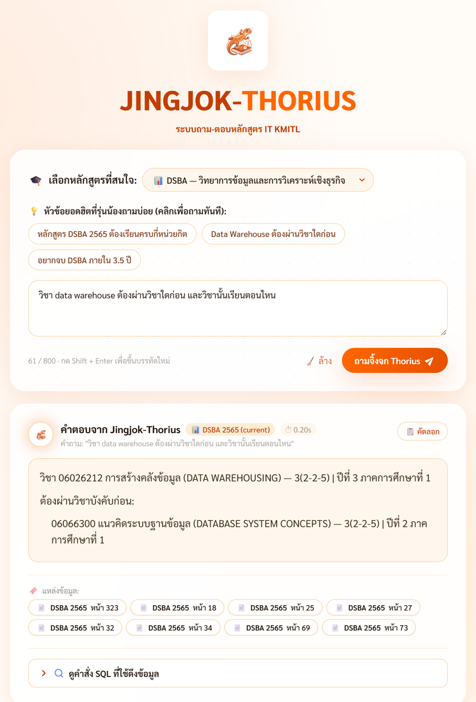

# Jingjok-Thorius (น้องจิ้งจก-ทองหล่อ)

ระบบถาม-ตอบหลักสูตรคณะเทคโนโลยีสารสนเทศ สจล. จากเล่ม มคอ.2 จำนวน 14 เล่ม (3,689 หน้า, 5 หลักสูตร: IT, DSBA, AIT, BIT, AITBA)
เลือกหลักสูตร พิมพ์คำถามภาษาไทย แล้วได้คำตอบพร้อมเลขหน้าที่อ้างอิง และดูคำสั่ง SQL ที่ใช้ดึงข้อมูลได้



วิชา: 06026240 Intelligent System Development

---

## วิธีใช้งานครั้งแรก

ทดสอบบน Windows 10/11 ใช้ Python 3.11 (โปรเจกต์กำหนด `>=3.11,<3.12`)

**1. ติดตั้ง Python 3.11** จาก python.org และติ๊ก "Add python.exe to PATH" ตอนติดตั้ง

**2. ติดตั้งไลบรารี** เปิด Command Prompt ในโฟลเดอร์โปรเจกต์ แล้วรัน

```
pip install -r requirements.txt
```

ขั้นนี้ดาวน์โหลด `torch` (ใช้ CPU ได้ ไม่ต้องมี GPU) จึงใช้เวลาหลายนาที

**3. ใส่ API key** คัดลอก `.example.env` เป็น `.env` แล้วแก้บรรทัดนี้

```
TYPHOON_API_KEY=ใส่คีย์ของคุณ
```

สมัครฟรีที่ https://opentyphoon.ai คีย์ใช้สำหรับคำถามเชิงเหตุผล เช่น "ลงวิชานี้ปีสองได้ไหม" ถ้าไม่ใส่ ระบบยังตอบคำถามที่มาจากตารางได้ (ปี/ภาค, วิชาบังคับก่อน ฯลฯ) แต่คำถามเชิงเหตุผลจะได้หลักฐานดิบแทนคำตอบสรุป

**4. เปิดระบบ** ดับเบิลคลิก `start.bat` ครั้งแรกมันจะทำสองอย่างให้เอง

- แตกไฟล์ฐานข้อมูล `artifacts/katrag.sqlite3.gz` เป็น `katrag.sqlite3` (~110 MB)
- ดาวน์โหลดโมเดล `BAAI/bge-m3` (~2.3 GB ต้องต่ออินเทอร์เน็ต ใช้เวลาตามความเร็วเน็ต)

จากนั้นเบราว์เซอร์จะเปิดที่ http://127.0.0.1:8000/ ให้อัตโนมัติ คำถามแรกอาจช้าประมาณ 1 นาทีเพราะต้องโหลดโมเดลเข้าหน่วยความจำ คำถามถัดไปเร็วขึ้นมาก

**5. ใช้งาน** เลือกหลักสูตรจาก dropdown พิมพ์คำถามหรือกดคำถามตัวอย่าง แล้วกด "ถามจิ้งจก Thorius"

ปิดระบบด้วย `Ctrl+C` ในหน้าต่างที่เปิดค้างไว้

### หรือใช้คำสั่ง

```
pip install -r requirements.txt
cp .example.env .env          # แล้วใส่ TYPHOON_API_KEY
python setup_db.py            # แตกฐานข้อมูล
python setup_model.py         # ดาวน์โหลด bge-m3
python -m uvicorn katrag.api.service:app --host 127.0.0.1 --port 8000
```

### ถ้าติดปัญหา

| อาการ | วิธีแก้ |
| :--- | :--- |
| ทุกคำถามตอบข้อผิดพลาด / ไม่พบฐานข้อมูล | รัน `python setup_db.py` และตรวจว่ามี `artifacts/katrag.sqlite3.gz` ครบ (clone ให้เสร็จสมบูรณ์) |
| `pip install` ล้มเหลวเรื่อง path ยาว | ย้ายโปรเจกต์ไปไว้ใกล้ราก เช่น `C:\jingjok` |
| คำตอบเชิงเหตุผลเป็นข้อความ "ระบบสรุปคำตอบด้วย LLM ไม่พร้อมใช้งาน" | ยังไม่ได้ใส่ `TYPHOON_API_KEY` ใน `.env` หรือไม่ได้ต่ออินเทอร์เน็ต |
| พอร์ต 8000 ถูกใช้อยู่ | ปิดโปรแกรมที่ใช้พอร์ตนั้น หรือเปลี่ยน `[api].port` ใน `config/katrag.toml` |
| ไม่ได้ติดตั้ง torch | ระบบเปิดได้ แต่ถอยไปใช้ค้นหาด้วยคำอย่างเดียว คำตอบบางประเภทแย่ลง |

---

## ตัวอย่างคำถาม

| คำถาม | หลักสูตร | ได้อะไร |
| :--- | :---: | :--- |
| ปีหนึ่งเทอมหนึ่งเรียนวิชาอะไร | DSBA | รายวิชาปี 1 ภาค 1 พร้อมหน่วยกิต |
| วิชา data warehouse ต้องผ่านวิชาใดก่อน | DSBA | วิชาบังคับก่อน และปี/ภาคของวิชานั้น |
| วิชาเกี่ยวกับเครือข่ายมีกี่วิชา | IT | รายวิชา จำนวน และหน่วยกิตรวม |
| ลงวิชา data warehouse ตอนปีสองได้ไหม เพราะอะไร | DSBA | ตอบได้/ไม่ได้ พร้อมเหตุผล (ใช้ LLM) |
| วิชาที่มีในหลักสูตรเก่า แต่ไม่มีในหลักสูตรใหม่ | DSBA | รายวิชาที่หายไประหว่าง 2560 กับ 2565 |

---

## ผลทดสอบ

ชุดทดสอบ 92 ข้อ ยิงเข้า `POST /ask` จริง แล้วอ่านคำตอบเทียบเฉลยที่เขียนจากเล่ม มคอ.2 ทีละข้อ ทุกข้อและหมายเหตุผู้ตรวจอยู่ใน [`docs/tester.xlsx`](docs/tester.xlsx) ข้อมูลดิบใน `docs/*.json`

**ผลล่าสุด: ถูกครบ 85 / บางส่วน 7 / ผิด 0** (ตอบเฉลี่ย 0.61 วินาที, 87 จาก 92 ข้อตอบใน 5 วินาที)

| ชุด | ข้อ | ถูกครบ | บางส่วน | ผิด | เนื้อหา |
| :--- | :---: | :---: | :---: | :---: | :--- |
| ชุดหลัก | 28 | 25 | 3 | 0 | ง่าย 9 · กลาง 9 · ยาก 7 · ท้าทาย 3 |
| ชุดเพิ่ม | 24 | 22 | 2 | 0 | ง่าย/กลาง/ยาก อย่างละ 8 ข้ามหลักสูตร |
| ชุด W | 10 | 10 | 0 | 0 | หน่วยกิตรายหมวด, แผนสหกิจ |
| ชุดจาก tester | 10 | 9 | 1 | 0 | ถามด้วยชื่อวิชา, แขนง/โมดูล, อาจารย์ |
| ข้อท้าทาย X/Y/Z | 20 | 19 | 1 | 0 | ข้ามเวอร์ชัน/ข้ามหลักสูตร, ป.โท-เอก, prerequisite หลายชั้น |
| **รวม** | **92** | **85** | **7** | **0** | |

ข้อที่ตอบถูกบางส่วน: H1 (ไม่สรุปแผนรายเทอม), H2 (เรียกวิชาเลือกว่าวิชาบังคับ), C1 (ส่วนแขนงต่างจากเฉลย), M11 (นับวิชาตามความหมาย ไม่มีเฉลยตัวเลข), M14 (IT ปี 3 ภาค 1 เรียกวิชาเลือกในโมดูลว่าบังคับ), X5 (เทียบแผนปริญญาโทแต่ตอบจำนวนรับนักศึกษา), T10 (ตอบเฉพาะวุฒิปริญญาตรี)

### ข้อควรรู้ของผล

- คำตอบของข้อที่เรียก LLM เปลี่ยนได้ทุกรอบ ข้อที่ตอบจาก SQL ได้เหมือนเดิมทุกครั้ง
- ความถูกต้องของ citation วัดแยก (19 ข้อ, `python -m katrag.eval.qa_eval`): precision 0.60, recall 0.50, retrieval hit 17/19
- ข้อมูลที่สกัดเทียบเฉลยอาจารย์ (272 วิชา): ชื่อไทย 91.9%, ชื่ออังกฤษ 92.6%, หน่วยกิต 99.6%, ชั้นปี 97.9%, ภาค 100% (วัดบนหน้าที่ใช้ text layer ไม่ใช่ผล OCR)
- OCR (Tesseract) CER 4.5% (paired-page 56 หน้า) ส่วนใหญ่ที่ผิดคือลำดับการอ่านในหน้าตาราง

รันซ้ำเอง: เปิดเซิร์ฟเวอร์แล้ว `python run_live_qa_tests.py` (หรือ `--replay docs/reviewed_run.json` เพื่อสร้างรายงานจากคำตอบที่ตรวจไว้โดยไม่ต้องเปิดเซิร์ฟเวอร์) ผลตรวจโดยคนอยู่ใน `docs/manual_review.json` ผูกกับข้อความคำตอบ ถ้าคำตอบเปลี่ยน ข้อนั้นจะขึ้นว่า "ยังไม่ได้ตรวจ"

---

## โครงสร้างระบบ

```
เบราว์เซอร์ (web/)  ->  FastAPI (katrag/api/service.py)
                              |
                    katrag/query/pipeline.py
          ┌───────────────────┼───────────────────┐
   Structured SQL       Hybrid search          Typhoon LLM
 (ตาราง course ฯลฯ)   (FTS5 + bge-m3, RRF)   (สรุปคำตอบเชิงเหตุผล)
          └───────────────────┼───────────────────┘
                    SQLite (artifacts/katrag.sqlite3)
```

ขั้นตอนทำฐานข้อมูล: อ่านแต่ละหน้าด้วย PyMuPDF (text layer) หรือ Tesseract 5 (หน้าที่เป็นภาพ) -> จัดเรียงภาษาไทย -> สกัดรายวิชา/วิชาบังคับก่อน -> ตัดเป็น chunk -> ทำดัชนี FTS5 และ embedding bge-m3 ข้อมูลทุกแถวผูกกับเอกสาร/หน้า/พิกัด

โฟลเดอร์หลัก

| โฟลเดอร์/ไฟล์ | หน้าที่ |
| :--- | :--- |
| `katrag/ingest/` | อ่านเล่ม, OCR, จัดเรียงภาษาไทย, สกัดรายวิชา |
| `katrag/query/` | pipeline ตอบคำถาม, structured query, hybrid retrieval, เรียก Typhoon |
| `katrag/api/` | FastAPI service |
| `katrag/eval/` | สคริปต์วัดผล (OCR, ฟิลด์, QA, citation, consistency) |
| `web/` | หน้าเว็บ (HTML/CSS/JS) |
| `config/` | ค่าตั้งค่า (`katrag.toml` ฯลฯ) |
| `docs/` | `tester.xlsx` และผลตรวจ, `er_diagram.md` (แผนภาพ ER), `removed_subsystems.md` (โค้ดที่ถอดออกและเหตุผล) |
| `tests/` | เทสต์ (`python -m pytest tests`) |

---

## API

เซิร์ฟเวอร์ `127.0.0.1:8000` 

| Method | Path | หน้าที่ | Status |
| :---: | :--- | :--- | :---: |
| POST | `/ask` | ถามคำถาม ได้คำตอบ + citation + SQL | 200, 422, 504 |
| GET | `/documents` | รายชื่อเอกสาร (**ยังไม่ได้ต่อกับฐานข้อมูล คืนรายการว่าง**) | 200 |
| GET | `/pages/{citation_id}` | หน้าที่ถูกอ้างอิงของคำตอบล่าสุด (`bbox` เป็น `null`) | 200, 404 |
| GET | `/traces/{request_id}` | สถิติของคำขอ (เก็บใน memory) | 200, 404 |

**Request** (`question` ยาว 1-2,000 ตัวอักษร, `program` เป็น `IT`, `DSBA`, `AIT`, `BIT` หรือ `AITBA`)

```json
{ "question": "วิชา data warehouse ต้องผ่านวิชาใดก่อน และวิชานั้นเรียนตอนไหน", "program": "DSBA" }
```

**Response 200** (ผลจริง ตัดรายการ citation และ SQL ให้สั้นลง)

```json
{
  "request_id": "bc0b3e33-65b3-4d55-ba86-46d66d6f1d02",
  "answer": "วิชา 06026212 การสร้างคลังข้อมูล (DATA WAREHOUSING) — 3(2-2-5) | ปีที่ 3 ภาคการศึกษาที่ 1\n  ต้องผ่านวิชาบังคับก่อน:\n    • 06066300 แนวคิดระบบฐานข้อมูล (DATABASE SYSTEM CONCEPTS) — 3(2-2-5) | ปีที่ 2 ภาคการศึกษาที่ 1",
  "citations": [
    { "citation_id": "cite-001", "document_id": "a39d6db17ccc5cf4", "page": 323, "heading": "ตารางรายวิชา/แผนการศึกษา" },
    { "citation_id": "cite-002", "document_id": "a39d6db17ccc5cf4", "page": 18, "heading": "ระบบสารสนเทศเพื่อการจัดการ" }
  ],
  "versions_resolved": ["DSBA 2565 (current)"],
  "citations_removed": 0,
  "unsupported_claims": 0,
  "total_time_seconds": 0.1881,
  "sql_query": "-- Query 1 SELECT code, name_th, name_en, credits_raw, year, semester, ... FROM course WHERE ..."
}
```


---

## หน้าเว็บ (4 สถานะ)

ไฟล์ `web/index.html`, `web/style.css`, `web/app.js` (HTML/CSS/JS ล้วน เรียก `/ask` ด้วย `fetch()`) ภาพ wireframe อยู่ที่ [`wireframe/wireframe-jingjok.png`](wireframe/wireframe-jingjok.png) และคำอธิบายใน [`wireframe/README.md`](wireframe/README.md)

| สถานะ | เมื่อไร | หน้าจอแสดงอะไร |
| :--- | :--- | :--- |
| Idle | เปิดหน้าเว็บ / กดล้าง | เลือกหลักสูตร, คำถามตัวอย่าง, กล่องพิมพ์พร้อมตัวนับ 0/800 |
| Loading | กดส่งคำถาม | spinner และปุ่มส่งถูกปิดกันกดซ้ำ |
| Success | ได้ 200 | คำตอบ (Markdown), ป้ายเวอร์ชันและเวลา, ชิปอ้างอิงหน้า (คลิกดูเนื้อหา), แผงพับดู SQL, ปุ่มคัดลอก |
| Error | ไม่เลือกหลักสูตร / 422 / 504 / เครือข่ายขัดข้อง | แถบเตือนพร้อมข้อความภาษาไทย แก้คำถามแล้วลองใหม่ได้ |

---

## ไฟล์ส่งงาน

| รายการ | ที่ตั้ง |
| :--- | :--- |
| Wireframe | `wireframe/wireframe-jingjok.png`, `wireframe/README.md` |
| README | `README.md` |
| หน้าเว็บ | `web/index.html`, `web/style.css`, `web/app.js` |
| ตัวอย่างตัวแปรสภาพแวดล้อม | `.example.env` (และ `.env.example`) |
| ผลทดสอบ 92 ข้อ (28 ชุดหลัก + 24 ชุดเพิ่ม + 10 ชุดใหม่ + 10 ชุดจาก tester + 20 ข้อท้าทาย) | `docs/tester.xlsx` |
| สคริปต์ทดสอบ | `run_live_qa_tests.py` |
| ฐานข้อมูล (บีบอัด) | `artifacts/katrag.sqlite3.gz` |
| ไลบรารีที่ต้องใช้ | `requirements.txt` |
