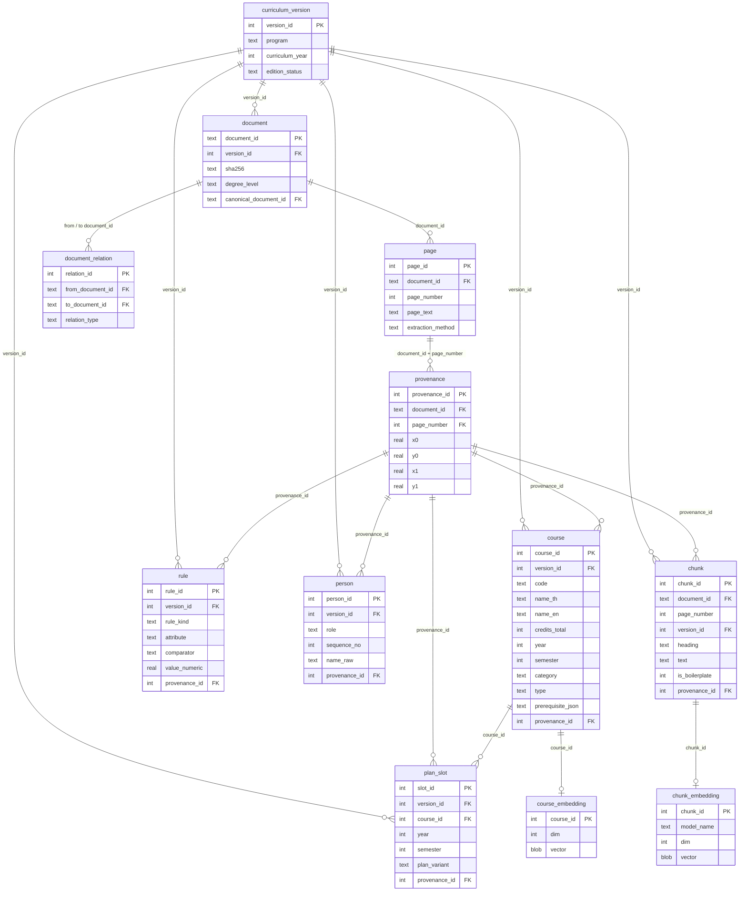

# ER diagram

ตารางหลักของฐานข้อมูล `artifacts/katrag.sqlite3` (ตารางทั้งหมดดูที่ `katrag/store/schema.sql`)
ทุกตารางข้อมูลมี `version_id` (ชี้ไปเวอร์ชันหลักสูตร) และ `provenance_id` (ชี้กลับพิกัดข้อความในหน้าเอกสาร)

`chunk_fts` เป็น FTS5 virtual table (ดัชนีค้นด้วยคำของ `chunk.text` และ `chunk.heading`) ไม่ได้วาดในภาพ

จำนวนแถวจริง: curriculum_version 13, document 14, page 3,689, provenance 38,721, course 1,419, plan_slot 329, chunk 11,587, chunk_embedding 11,587, course_embedding 1,419, rule 2, person 126, document_relation 2
